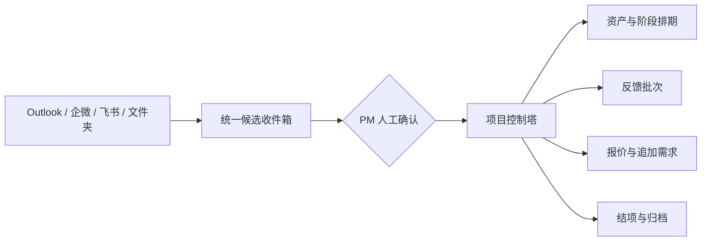

# GamePMer

GamePMer 是面向游戏美术项目经理的 Windows 本地工作台。它将 Outlook、企业微信、飞书、项目文件夹和历史 Excel 排期中的信息，汇总为可确认的候选事项，再关联到项目、资产、制作阶段、反馈、报价和结项流程。

项目的核心目标不是替代人的判断，而是让 PM 随时看清：今天必须处理什么、哪些节点存在风险、问题由谁或哪一方造成，以及每项决定可以追溯到哪条原始信息。

> 当前状态：需求探索和总体设计已完成，尚未开始业务代码实现。

## 为什么需要 GamePMer

游戏美术 PM 同时面对多个并行项目，信息分散在聊天、邮件、文件盘和排期表中。常见问题包括：

- 重要反馈被连续群消息淹没。
- “制作完成”“已提交客户”“客户确认”被混为同一种完成状态。
- 客户反馈延迟、返修和需求变更造成的排期影响难以归因。
- 报价、制作、结项和出账之间的数据需要反复整理。
- PM 成为人工消息中转站，项目全貌依赖个人记忆。

GamePMer 采用“项目控制塔 + 统一收件箱”的组合设计：排期和正式状态以工作台为唯一数据源，外部消息先经过识别与人工确认，再进入正式流程。

## 产品原则

1. **人工确认优先**：AI 只生成候选结果，不自动发信、不自动改排期、不自动移动正式资产。
2. **异常优先**：默认首页突出 T-1、延期、客户等待、待重排和连接异常，而不是展示所有正常事项。
3. **原始信息可追溯**：摘要、状态、附件、文件路径和原消息保持关联。
4. **责任边界清楚**：区分团队延期、客户反馈延期、返修和追加需求。
5. **本地优先**：单用户 Windows 桌面应用，本地数据库、本地备份，各试用者数据互不共享。
6. **逐步接入**：Outlook 优先；企微和飞书在管理员批准的官方能力范围内接入，并保留手动导入降级方案。

## 规划中的能力

| 模块 | 主要能力 | 计划阶段 |
| --- | --- | --- |
| 今日控制台 | 风险、T-1、延期、等待客户确认、待处理汇总 | M1 |
| 项目与排期 | 资产级阶段排期、人天、工作日日历、基准/当前/实际日期 | M1 |
| Excel 迁移 | 导入历史排期，导出汇报和备份表格 | M1 |
| Outlook 收件箱 | 读取指定文件夹、识别邮件、创建邮件草稿 | M2 |
| AI 候选识别 | 项目、资产、阶段、日期、路径、反馈与风险提取 | M2 |
| 反馈中心 | 反馈批次、资产子任务、版本、附件和反馈盘归档 | M3 |
| 企微/飞书连接器 | 项目群消息采集；无权限时转发、粘贴和截图导入 | M3 |
| 报价与变更 | BD 需求、2D/3D 报价、复核、开工和追加需求 | M4 |
| 结项中心 | 最终包、IT 剪切备份确认和 BD 出账通知 | M4 |
| 分析与发布 | 负载趋势、偏差复盘、MSIX 打包与试用反馈 | M5 |

## 核心工作流



外部信息只有通过 PM 确认后，才可以改变正式项目状态。工作台可以生成草稿和建议，但不会代替 PM 执行对外动作。

## 制作阶段模板

- 2D：草图 → 细化 50% → 完成稿。
- 3D：中模 → 高模 → 低模 → 烘焙 → 贴图 → LOD。

每个阶段都必须经过客户确认后才能进入下一阶段。组内审核不在 GamePMer 中管理；团队发送的完成邮件是交接给 PM 的正式信号。

排期同时保留三套日期：

- **基准排期**：报价或开工时确认，不允许覆盖。
- **当前排期**：PM 根据反馈与实际情况手工修订。
- **实际日期**：真实开始、完成、提交和客户确认时间。

## 技术方向

- Windows 11 x64 桌面应用；Windows 10 仅支持公司仍处于 ESU/LTSC 支持周期内的设备。
- C#、.NET 10 LTS、WPF、MVVM。
- SQLite / EF Core 本地持久化。
- Outlook 经典桌面客户端对象模型集成。
- DPAPI 保护 API Key 和数据库密钥。
- MSIX 用于公司内网分发和试用升级。

技术选型与模块边界见 [总体技术设计](docs/superpowers/specs/2026-07-15-gamepmer-workbench-design.md)。

## 安全设计

- 数据默认只存放在当前 Windows 用户的本机目录。
- API Key 不写入普通配置、日志或导出文件。
- LLM 调用可按项目关闭；AI 输出始终需要人工确认。
- 邮箱连接器默认只读指定文件夹，发送动作仅创建草稿。
- 企微与飞书仅使用公司管理员批准的官方接口。
- 日志不得记录邮件正文、聊天原文、附件内容、API Key 或数据库密钥。

## 计划中的仓库结构

```text
GamePMer/
├─ src/
│  ├─ GamePMer.Domain/          # 业务实体、状态和不可变规则
│  ├─ GamePMer.Application/     # 用例、端口和查询模型
│  ├─ GamePMer.Infrastructure/  # SQLite、Outlook、文件、AI 和备份适配器
│  └─ GamePMer.Desktop/         # WPF 壳、页面和 ViewModel
├─ tests/
│  ├─ GamePMer.Domain.Tests/
│  ├─ GamePMer.Application.Tests/
│  ├─ GamePMer.Infrastructure.Tests/
│  └─ GamePMer.Desktop.Tests/
├─ docs/
│  ├─ PRD.md
│  └─ superpowers/
│     ├─ specs/
│     └─ plans/
└─ README.md
```

## 开发脉络

每个里程碑遵循相同顺序：

1. 明确该里程碑的用户结果和不做事项。
2. 编写可验收的设计与实施计划。
3. 使用测试驱动方式实现领域规则和用例。
4. 接入基础设施和界面。
5. 运行自动测试、手工场景验证和安全检查。
6. 记录决策、迁移说明和已知限制后再进入下一阶段。

第一份可执行计划见 [M1：基础与排期控制塔实施计划](docs/superpowers/plans/2026-07-15-m1-foundation-schedule-control-tower.md)。后续里程碑将在前一阶段验证完成后分别编写实施计划，避免提前固化尚未验证的接口细节。

## 文档

- [产品需求文档（PRD）](docs/PRD.md)
- [总体技术设计](docs/superpowers/specs/2026-07-15-gamepmer-workbench-design.md)
- [M1 实施计划](docs/superpowers/plans/2026-07-15-m1-foundation-schedule-control-tower.md)

## GitHub 发布前检查

- 使用模拟项目、虚构客户和脱敏截图编写示例。
- 清除本地数据库、日志、API Key、邮件缓存和 `.superpowers/` 草图。
- 添加适合项目发布方式的许可证；当前未授予开源许可。
- 配置 CI，在 Windows 环境运行构建、测试和格式检查。
- 生成签名的试用安装包，并记录校验值和升级说明。

## 贡献状态

项目当前处于实施前准备阶段。公开接受贡献之前，需要先完成 M1、确定许可证和贡献规范。
