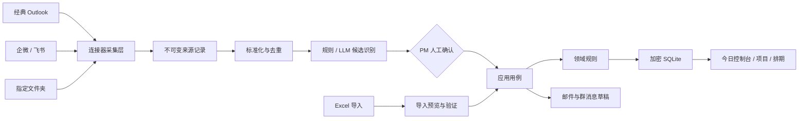
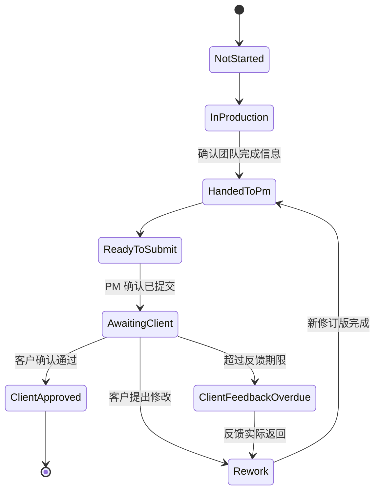

# GamePMer 工作台总体设计

## 1. 设计状态

- 日期：2026-07-15
- 状态：产品边界已确认，等待用户审阅书面设计
- 对应 PRD：[`docs/PRD.md`](../../PRD.md)
- 当前实现状态：尚未创建业务代码

## 2. 设计目标

构建一个 Windows 单用户、本地优先的游戏美术 PM 工作台。工作台以项目和资产阶段排期为正式数据中心，以统一候选收件箱接收 Outlook、项目群和文件夹信息，并坚持“AI 建议、PM 确认、正式状态可追溯”的控制边界。

该设计覆盖总体产品，但实施按 M1–M5 独立推进。第一份实施计划只覆盖 M1 基础与排期控制塔，确保每个里程碑都能交付可运行、可测试的软件。

## 3. 已确认的关键决策

1. 仅支持 Windows 单用户；同事试用时各自安装、各自保存数据。
2. 工作台成为正式排期的唯一数据源；Excel 只做导入和导出。
3. 每个资产的每个制作阶段都有预估人天、开始和完成日期。
4. 基准、当前和实际日期分离；后续排期只允许 PM 手工调整。
5. 周末和公司节假日默认不计入人天。
6. 每个阶段必须获得客户确认后才能进入下一阶段。
7. 组内审核、具体制作人员和个人负载不纳入系统。
8. 所有邮件、群消息、排期和归档动作必须经过 PM 确认。
9. Outlook 经典桌面客户端优先接入；企微/飞书需要管理员批准官方接口。
10. LLM 支持国内外供应商预设；API Key 由 Windows DPAPI 保护。
11. 数据和自动备份只保存在本机。
12. 通知 BD 出账后项目归档，不跟踪开票和回款。

## 4. 技术方案选择

### 4.1 选择：.NET 10 + WPF

采用 C#、.NET 10 LTS 和 WPF。WPF 是 Windows 专用 .NET 桌面 UI 框架，适合本地文件、经典 Outlook 对象模型、Windows 凭证和企业安装包的集成。[WPF 官方概览](https://learn.microsoft.com/en-us/dotnet/desktop/wpf/overview/)；[.NET 10 支持策略](https://dotnet.microsoft.com/en-us/platform/support/policy)。

选择 WPF 而非 Electron/Tauri 的原因：

- 产品只需要 Windows，不需要跨平台运行时成本。
- 经典 Outlook 对象模型、DPAPI 和 Windows 通知均可在同一 .NET 进程边界内适配。
- WPF 数据绑定、虚拟化列表和桌面键盘操作适合高密度 PM 工作台。
- .NET 10 和 EF Core 10 均为 LTS，技术生命周期清晰。[EF Core 10 官方说明](https://learn.microsoft.com/en-us/ef/core/what-is-new/ef-core-10.0/whatsnew)。

### 4.2 UI 模式

使用 MVVM，依赖 `CommunityToolkit.Mvvm`。View 只负责显示与交互，ViewModel 负责页面状态和命令，业务规则位于 Domain/Application，不写入 code-behind。MVVM Toolkit 可用于 WPF，且由 Microsoft 维护。[MVVM Toolkit 官方说明](https://learn.microsoft.com/en-us/dotnet/communitytoolkit/mvvm/)。

### 4.3 本地数据库

使用 EF Core 10、SQLite 和 SQLCipher 兼容原生库：

- `Microsoft.EntityFrameworkCore.Sqlite.Core` 10.0.10。
- `SQLitePCLRaw.bundle_e_sqlcipher` 2.1.11。
- 数据库连接使用 `Password`，密钥由 DPAPI CurrentUser 保护。

普通 SQLite 不提供文件级加密；Microsoft 文档要求使用 SQLCipher 等修改版原生库。[Microsoft.Data.Sqlite 加密说明](https://learn.microsoft.com/en-us/dotnet/standard/data/sqlite/encryption)。`SQLitePCLRaw.bundle_e_sqlcipher` 2.1.11 已停止维护。项目负责人接受在 M1 使用该依赖，并负责后续内部维护或替换；依赖必须锁定，M1 发布门包含加密可读性、错误密钥、备份恢复和升级兼容性测试，以及替换风险记录。

### 4.4 分发

开发阶段使用 `dotnet publish` 生成自包含 x64 构建。试用阶段增加 MSIX 包，用于公司内网分发、安装和卸载。WPF 桌面应用可以通过 Windows Application Packaging Project 生成 MSIX。[Microsoft MSIX 文档](https://learn.microsoft.com/en-us/windows/msix/desktop/vs-package-overview)。

## 5. 系统上下文



任何连接器或 AI 都不能直接更新项目表。正式变更必须通过 Application 命令，在同一事务内写入业务数据和审计事件。

## 6. 解决方案与目录边界

```text
GamePMer.sln
src/
├─ GamePMer.Domain/
│  ├─ Projects/
│  ├─ Scheduling/
│  ├─ Inbox/
│  ├─ Feedback/
│  ├─ Quoting/
│  ├─ Closeout/
│  └─ Common/
├─ GamePMer.Application/
│  ├─ Abstractions/
│  ├─ Projects/
│  ├─ Scheduling/
│  ├─ Dashboard/
│  ├─ Inbox/
│  ├─ Feedback/
│  ├─ Quoting/
│  └─ Closeout/
├─ GamePMer.Infrastructure/
│  ├─ Persistence/
│  ├─ Security/
│  ├─ Excel/
│  ├─ Outlook/
│  ├─ Chat/
│  ├─ Files/
│  ├─ AI/
│  ├─ Backup/
│  └─ Diagnostics/
└─ GamePMer.Desktop/
   ├─ Shell/
   ├─ Dashboard/
   ├─ Projects/
   ├─ Scheduling/
   ├─ Inbox/
   ├─ Feedback/
   ├─ Quoting/
   ├─ Closeout/
   └─ Settings/
tests/
├─ GamePMer.Domain.Tests/
├─ GamePMer.Application.Tests/
├─ GamePMer.Infrastructure.Tests/
└─ GamePMer.Desktop.Tests/
```

### 6.1 Domain

只包含业务实体、值对象、状态机和纯计算，不引用 WPF、EF Core、Outlook、文件系统、HTTP 或系统时间。

### 6.2 Application

包含用例命令、查询、DTO 和端口接口。Application 调用 Domain 并依赖抽象，例如 `IProjectRepository`、`IUnitOfWork`、`IClock`、`IHolidayCalendarStore` 和 `IAuditWriter`。

### 6.3 Infrastructure

实现持久化、加密、Outlook、Excel、文件夹、LLM、备份和诊断。所有第三方或操作系统 API 必须被封装在此项目内。

### 6.4 Desktop

WPF Shell、页面、ViewModel、导航和桌面通知。Desktop 只能调用 Application，不直接使用 DbContext 或 Outlook COM 对象。

## 7. 核心领域模型

### 7.1 Project

```text
Project
├─ Id: ProjectId
├─ Code: string (unique)
├─ Name: string
├─ ClientName: string
├─ ProductionType: TwoD | ThreeD | Mixed
├─ Status: Quoting | AwaitingKickoff | Active | Closing | ReadyToBill | Archived
├─ Roles: BD / Lead / ArtDirector
├─ Paths: Production / Submission / Feedback / FinalPackage
├─ CustomerFeedbackSlaDays: positive integer
├─ CalendarId: WorkCalendarId
└─ Assets: Asset[]
```

同一个 PersonId 可以承担多个角色。通知接收人按 PersonId/邮箱去重，审计事件仍分别记录业务角色。

### 7.2 Asset 和 StagePlan

```text
Asset
├─ Id / ProjectId / Code / Name
├─ ProductionType
├─ EstimatedPersonDays
├─ CurrentStageId
└─ StagePlans[]

StagePlan
├─ Id / AssetId / StageDefinitionId / Sequence
├─ EstimatedPersonDays
├─ BaselineStart / BaselineFinish
├─ CurrentStart / CurrentFinish
├─ ActualStart / ActualFinish
├─ SubmittedAt / CustomerApprovedAt
├─ Status
└─ RevisionRequired: bool
```

日期使用 `DateOnly` 表示排期日，事件时间使用 UTC `DateTimeOffset` 存储、界面按本地时区显示。

### 7.3 阶段模板

- `2D_SKETCH`：草图。
- `2D_DETAIL_50`：细化 50%。
- `2D_FINAL`：完成稿。
- `3D_MID`：中模。
- `3D_HIGH`：高模。
- `3D_LOW`：低模。
- `3D_BAKE`：烘焙。
- `3D_TEXTURE`：贴图。
- `3D_LOD`：LOD。

模板复制到项目后成为项目级定义。已有 StagePlan 引用项目级定义，模板全局修改不会静默改变在制项目。

### 7.4 ScheduleRevision

每次手工排期修改创建修订批次：

```text
ScheduleRevision
├─ Id / ProjectId
├─ ReasonCode
├─ Note
├─ CreatedAt / CreatedBy
└─ Items[]: StagePlanId, OldStart, OldFinish, NewStart, NewFinish
```

基准排期不在 ScheduleRevision 中被修改。当前阶段延期后，Application 将所有后续未完成阶段的 `RevisionRequired` 设为 true，但不改变日期。

### 7.5 WorkCalendar

保存周工作模式和日期覆盖：

- 默认周一至周五工作。
- 节假日覆盖为非工作日。
- 特殊加班日覆盖为工作日。

纯函数 `AddWorkdays(start, personDays)`、`PreviousWorkday(date)` 和 `CountWorkdays(start, finish)` 位于 Domain。

### 7.6 RiskItem

RiskItem 是可重建的查询结果，不作为业务真相单独维护。风险查询从 StagePlan、项目状态、提醒和连接器健康状态投影：

- DueToday。
- TMinusOne。
- Overdue。
- ClientFeedbackOverdue。
- ScheduleRevisionRequired。
- QuoteDueSoon。
- UnclassifiedHighPriority。
- ConnectorFailure。
- CloseoutBlocked。

风险关闭来自底层状态变化，不提供“直接删除风险”。

### 7.7 InboxCandidate 和 SourceRecord

`SourceRecord` 保存连接器原始标识、来源、时间、内容哈希、加密正文/附件引用和抓取元数据。记录创建后不修改正文。

`InboxCandidate` 保存分类类型、项目/资产/阶段候选、摘要、置信度、识别依据和审核状态。确认候选时执行明确 Application 命令，例如 `ConfirmCompletionEmail` 或 `ConfirmClientFeedback`。

### 7.8 后续领域

M3/M4 增加：FeedbackBatch、FeedbackItem、QuoteRequest、QuoteVersion、ChangeRequest、CloseoutCase。它们通过 ProjectId 与项目关联，不反向污染 Scheduling 核心。

## 8. 状态规则

### 8.1 StagePlan 主路径



进入下一阶段前，前一阶段必须为 ClientApproved。`ScheduleRevisionRequired` 和 `WaitingChangeQuote` 是覆盖标记，不取代主路径状态。

### 8.2 Project 结项路径

```text
Active
  → Closing（PM 通过结项检查）
  → FinalPackageReady（PM 确认最终包）
  → BackupRequested
  → BackupCompleted（PM 确认 IT 回复）
  → ReadyToBill
  → Archived（PM 发送 BD 出账通知）
```

归档后不允许修改排期、反馈和报价；重新打开项目会产生 `ProjectReopened` 审计事件。

## 9. 应用用例边界

M1 首批用例：

- `CreateProject`。
- `AddAssetsFromTemplate`。
- `SetStageSchedule`。
- `FreezeBaselineSchedule`。
- `ReviseCurrentSchedule`。
- `RecordStageActuals`。
- `MarkStageHandedToPm`。
- `MarkSubmittedToClient`。
- `RecordClientApproval`。
- `RecordClientFeedbackDelay`。
- `GenerateRiskDashboard`。
- `GenerateTMinusOneReminders`。
- `PreviewScheduleImport` / `CommitScheduleImport`。
- `ExportScheduleWorkbook`。
- `CreateBackup` / `RestoreBackup`。

每个命令返回明确结果：成功、验证失败、冲突或依赖失败。UI 不解析异常字符串决定业务状态。

## 10. 数据流设计

### 10.1 连接器采集

1. 连接器读取指定范围并保存外部游标。
2. 将消息标准化为 `CapturedItem`。
3. 根据外部 ID、线程 ID、附件哈希和内容哈希计算去重指纹。
4. 新信息写入 SourceRecord；重复信息关联已有记录。
5. 规则提取项目编号、资产编号、阶段和路径。
6. 可选 LLM 补充分类与摘要。
7. 生成 InboxCandidate，等待 PM 审核。

采集至少一次、应用至多一次：连接器可以重复抓取，但指纹和数据库唯一约束确保正式候选不重复。

### 10.2 Outlook

Outlook Classic 适配器运行在专用 STA 线程。它只读取用户配置的文件夹，使用 EntryID、StoreID、InternetMessageId 和 LastModificationTime 建立游标与去重。读取、筛选、创建草稿均通过适配器接口，COM 对象使用后立即释放。

Microsoft 官方说明 Outlook 对象模型支持读取、写入、筛选、搜索 Outlook 项目和处理事件，适合经典桌面客户端自动化。[Outlook 技术选择说明](https://learn.microsoft.com/en-us/office/client-developer/outlook/selecting-an-api-or-technology-for-developing-solutions-for-outlook)。

### 10.3 企微与飞书

M3 首先实现连接器可行性检查，不假设普通员工账号可读取全部聊天：

- 飞书：企业自建应用/机器人、批准的消息范围或项目群事件。
- 企业微信：自建应用消息或公司启用的会话内容存档。
- 无权限：转发机器人、粘贴文本、拖入截图。

所有路径输出统一 `CapturedItem`，上层业务不依赖具体平台。

### 10.4 LLM

`ILlmProvider` 统一接口：

```csharp
Task<LlmResult<T>> GenerateStructuredAsync<T>(
    LlmRequest request,
    CancellationToken cancellationToken);
```

供应商预设只保存非敏感元数据：BaseUrl、认证头格式、模型发现路径、默认超时和能力标记。API Key 由 `ISecretStore` 使用 DPAPI 存储。

结构化输出必须通过本地 JSON Schema/DTO 验证。429、超时和 5xx 使用有上限指数退避；401/403、结构验证失败和用户取消不自动重试。原始 AI 响应存入加密数据库，不写日志。

## 11. UI 设计

### 11.1 Shell

左侧主导航，顶部全局项目/资产搜索和连接状态，主区域显示当前页面。导航状态与窗口布局保存到本机用户设置。

### 11.2 今日控制台

采用已经确认的混合布局：

- 顶部：今日需处理、T-1、延期、客户等待。
- 中部：项目/资产阶段条和当前状态。
- 下部：按严重程度和截止时间排序的行动列表。

控制台默认“仅看异常”，允许按项目、2D/3D、阶段、风险原因和日期过滤。

### 11.3 项目与排期

项目详情包含：概览、资产与阶段、甘特图、修订记录、证据和设置。

甘特图使用虚拟化行列表和共享日期轴。拖动阶段条只修改页面草稿；松开后打开修订确认面板，用户选择原因并保存后才调用 `ReviseCurrentSchedule`。取消面板则恢复原位置。

### 11.4 候选收件箱

三栏布局：候选列表、原始信息、确认表单。高置信度只减少手工填写，不绕过确认门。批量操作只允许相同类型和相同目标项目的候选。

### 11.5 键盘与可访问性

- 所有主要操作有键盘路径。
- 风险不只用颜色区分，同时显示文本和图标。
- 高密度表格启用虚拟化、可调整列宽和持久化列设置。
- 不使用阻塞式弹窗处理普通提醒；破坏性操作才使用明确确认。

## 12. 持久化、安全与备份

### 12.1 数据位置

默认目录：

```text
%LOCALAPPDATA%\GamePMer\
├─ data\gamepmer.db
├─ backups\
├─ logs\
├─ cache\
└─ secrets\
```

目录 ACL 限制为当前 Windows 用户。业务数据库、缓存和诊断包不得写入仓库目录。

### 12.2 密钥

- 首次启动生成 32 字节随机数据库密钥。
- 使用 `ProtectedData.Protect(..., CurrentUser)` 保存密钥文件。
- API Key 每个供应商独立加密存储。
- 密钥不进入依赖注入配置快照、日志、异常消息或剪贴板历史。

DPAPI 使用 Windows 用户或机器凭证保护数据，无需额外密钥服务。[ProtectedData 官方说明](https://learn.microsoft.com/en-us/dotnet/api/system.security.cryptography.protecteddata)。

### 12.3 备份

- 每天首次成功写入后创建一个备份。
- 数据库迁移前创建备份。
- 保留最近 14 个日备份和 4 个周备份。
- 使用 SQLite Backup API 创建一致性副本，不直接复制正在写入的数据库文件。
- 备份创建后执行打开、schema 版本和关键表查询验证。
- 恢复前先备份当前数据库；恢复完成后运行完整性检查。

### 12.4 加密迁移包

用户主动导出迁移包时设置口令。系统先生成与数据库密钥无关的逻辑快照，包含格式版本、实体、关系和审计记录，再使用 PBKDF2-SHA256 派生 256 位密钥并以 AES-256-GCM 加密。包内包含随机 salt、nonce、格式版本和认证标签。导入时先校验认证标签和快照结构，再使用目标电脑新生成的数据库密钥创建加密数据库；不会把源电脑的 DPAPI 密钥或 SQLCipher 密钥带入迁移包。

## 13. 错误处理与恢复

### 13.1 领域验证错误

返回字段级错误，例如资产编号重复、阶段日期逆序、客户未确认却推进下一阶段。UI 保留用户输入并定位字段，不写入任何正式数据。

### 13.2 并发和冲突

单用户仍可能因后台任务和 UI 同时写入产生冲突。实体使用应用级版本号进行乐观并发。冲突时重新加载最新值，显示差异，不自动覆盖。

### 13.3 连接器错误

- 网络断开：记录失败并按上限重试，显示最后成功同步时间。
- 权限失效：停止自动重试，要求用户重新授权。
- Outlook 未运行：显示离线状态，允许手动重连。
- 文件路径不可访问：保留原路径和错误，不删除候选。
- LLM 失败：回退到规则提取或纯人工录入。

### 13.4 数据库错误

- 启动无法解密：停止进入主界面，不创建空数据库覆盖原文件。
- 迁移失败：自动恢复迁移前备份并生成脱敏诊断记录。
- 完整性检查失败：进入只读恢复界面，禁止继续写入。

### 13.5 草稿操作错误

创建邮件草稿使用幂等操作 ID。失败时不把提醒标记为已处理；重试前先检查是否已经存在对应草稿。

## 14. 日志与审计

### 14.1 诊断日志

允许记录：时间、组件、事件 ID、耗时、结果、错误类别、关联的内部 UUID。

禁止记录：邮件/聊天正文、附件内容、API Key、数据库密钥、完整客户路径、LLM 原始提示词。

### 14.2 业务审计

审计事件记录：操作类型、实体 ID、修改摘要、旧值/新值、原因、时间和本机 Windows 用户标识。业务审计存入加密数据库，不与诊断日志混合。

## 15. 测试策略

### 15.1 Domain 单元测试

- 工作日加减、节假日和特殊工作日。
- 2D/3D 阶段顺序。
- 客户确认阶段门。
- 基准日期不可变。
- 当前排期修订和后续 `RevisionRequired`。
- T-1、延期和客户反馈逾期。
- 同一人员多角色通知去重。

### 15.2 Application 用例测试

使用内存仓储替身验证命令原子性、审计事件和错误返回。时钟通过 `IClock` 注入。

### 15.3 Infrastructure 集成测试

- 加密数据库无法在无密钥时读取。
- EF Core 迁移和唯一约束。
- Excel 预览、错误定位、导入与回导。
- 备份创建、轮换、验证和恢复。
- Outlook 适配器使用封装层替身；真实 Outlook 验证作为 Windows 手工/自动化测试，不进入普通 CI。

### 15.4 Desktop 测试

ViewModel 命令、筛选和错误状态使用单元测试。关键页面进行手工可访问性、键盘、缩放和高数据量验证。

### 15.5 端到端验收

M1 验收场景：导入一个含 2D/3D 资产的排期，冻结基准，修改当前排期，制造 T-1/延期/客户等待，确认控制台风险正确，导出 Excel，备份并恢复。

## 16. 实施顺序

1. M1 基础与排期控制塔。
2. M2 Outlook 与 AI 候选收件箱。
3. M3 反馈中心与项目群。
4. M4 报价、追加需求与结项。
5. M5 分析、打包与试用。

每个里程碑完成后再为下一阶段编写文件级实施计划。总体设计定义稳定接口，但不提前实现尚未被真实数据验证的连接器细节。

## 17. 设计自检结果

- 占位符扫描通过，所有模块都有明确边界或里程碑归属。
- 产品边界与 PRD 一致：不自动发送、不自动重排、不管理具体制作人员。
- 总体范围拆为五个可独立验收里程碑，M1 可单独形成可用产品。
- 技术依赖均位于 Infrastructure，Domain/Application 保持可测试。
- 已明确数据库加密依赖的维护风险和发布门，不将其隐藏为实现细节。
