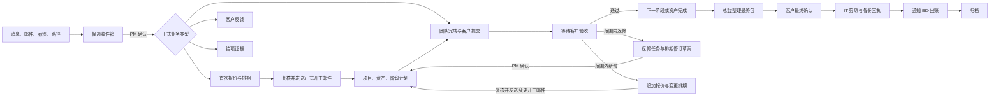
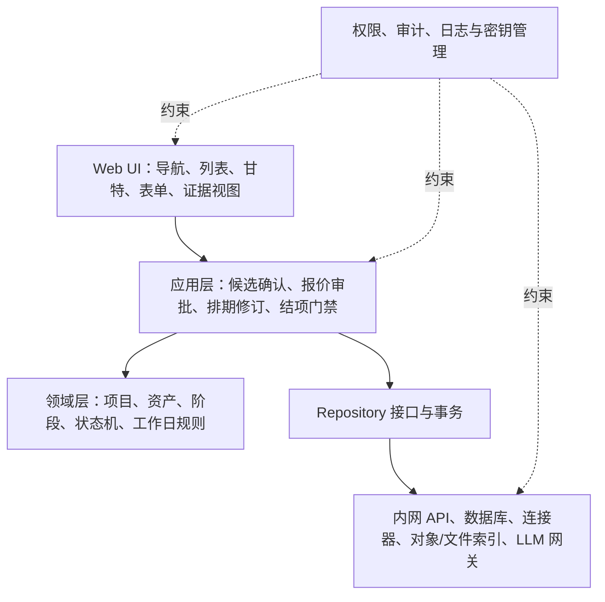

# GamePMer 内网 Web 工作台重设计说明

## 1. 文档状态

- 状态：视觉方向与业务设计已确认，等待书面设计说明审阅。
- 产品形态：部署在公司内网的桌面优先 Web 工作台。
- 目标用户：游戏美术项目经理，以及后续获得授权的组长、艺术总监、BD 和 IT 协作人员。
- 设计基线：延续参考图的整体结构与信息密度，改为白色主题，并以真实业务对象和状态机替代纯展示型卡片。
- 原型陪伴页：见 `docs/design-assets/2026-07-27-white-ui/prototypes/`，用浏览器直接打开静态 HTML。

本文在平台与 UI 方向上取代 `2026-07-15-gamepmer-workbench-design.md` 中的 WPF 桌面应用方案，并扩展 `2026-07-17-web-demo-schedule-replan-design.md`：从单一“反馈导致重排”演示，扩展为候选信息、报价、开工、制作、客户反馈、排期修订、结项、备份和出账的完整产品设计。

旧 PRD 中与 Windows 本地应用绑定的技术结论不再作为实现约束。本文通过审阅后，应据此更新正式 PRD、README 和实施计划。

## 2. 要解决的问题

PM 同时管理多个 2D、3D 项目时，信息分散在企业微信、飞书、邮件和网络盘路径中。真正的困难不是缺少一个任务列表，而是以下信息不能及时对齐：

1. 客户反馈、团队完成邮件和 BD 需求需要人工识别并归档到正确项目、资产和阶段。
2. 计划、实际完成、客户等待和反馈返修混在一起，无法快速判断项目是否真的延期。
3. 客户反馈经常造成后续阶段重排，但原基准、当前计划和实际日期缺少统一记录。
4. 首次报价、追加报价、复核和正式开工之间缺少清晰门禁。
5. 结项、最终包、客户确认、IT 备份和 BD 出账依赖人工记忆，证据容易丢失。
6. 并行项目很多时，轻重任务无法形成可比较的时间视图和可行动优先级。

本产品的核心不是“替 PM 自动做决定”，而是把来源证据、正式状态、建议动作和责任边界放到同一条可追溯业务线上。

## 3. 产品原则与权限边界

### 3.1 核心原则

1. **项目是根对象。** 资产、阶段、反馈、报价、排期修订和结项均挂在项目下；任务只是从正式状态投影出的行动视图。
2. **候选信息不等于正式记录。** 所有外部消息先进入候选收件箱，未经 PM 确认不得修改项目、排期或结项状态。
3. **基准不可覆盖。** 排期同时保留基准日期、当前计划和实际日期；修订产生新版本，不覆写历史。
4. **AI 只辅助，不代替确认。** AI 可以识别、分类、提取字段、评估影响、推荐动作和起草通知，但不能自动发信、确认报价、修改正式排期或关闭项目。
5. **证据驱动门禁。** 关键状态必须关联来源邮件、消息、截图、文件路径或人工确认记录，缺少证据时阻止进入下一正式状态。
6. **文件操作留在公司系统。** 工作台保存路径、索引、状态和回执，不直接剪切、删除网络盘文件，也不代替 IT 执行备份。
7. **异常需要解释。** 风险必须同时展示状态文字、原因和影响范围，不能只依赖颜色。

### 3.2 集成与保密边界

- 企业微信、飞书和邮件仅在公司账号、管理员授权和官方接口允许的范围内自动接入。
- 无法授权的私人会话通过转发给机器人、快捷复制、粘贴文本或截图导入。
- 工作台部署在公司内网，后续可向公司同事开放试用；账号、权限和审计能力应支持多人使用。
- 公司允许访问大模型 API。设置页提供多个 LLM 供应商预设，地址、模型和常用参数预填，管理员或授权用户只填写 API Key。
- API Key 不进入前端仓库、日志、导出文件或普通业务数据库明文字段；正式环境由内网服务端的密钥管理提供。
- 所有正式写操作记录操作人、时间、原值、新值和来源证据。

## 4. 信息架构与视觉外壳

### 4.1 全局导航

左侧导航保持完整展开，不折叠、不删减：

1. 任务管理
2. 项目总览
3. 候选收件箱
4. 排期管理
5. 反馈中心
6. 报价与变更
7. 结项中心
8. 文件与归档
9. 智能分析
10. 设置中心

导航较长是已接受的信息架构选择。它承载稳定的业务分区，不能以“减少长度”为理由隐藏关键模块。

### 4.2 全局页面结构

页面忠实延续参考图的结构思路：

- 左侧：固定全局导航、工作区与当前用户。
- 顶部：全局搜索、快捷新增、通知和个人入口。
- 首屏上部：今日待办、进行中、已完成、逾期/可能延期等指标。
- 主区左侧：项目、资产、反馈或候选列表。
- 主区中央：当前页面的核心工作面板，如甘特图、反馈分解或报价版本。
- 主区右侧：上下文详情、来源证据、AI 建议和正式动作。
- 页面底部：时间线、流程门禁或版本历史。

首页是每日控制页，用于找到最值得处理的事项；项目详情、报价中心、反馈中心和结项中心才是对应业务的事实来源。

### 4.3 视觉语言

- 白色和浅暖灰分层，避免黑色“任务指挥台”风格。
- 鼠尾草绿用于正式计划、已确认和主要操作。
- 琥珀色用于客户反馈、待确认草案和需要复核的候选信息。
- 克制红色只用于已确认的高风险、阻断和逾期，不作为普通强调色。
- 正文实际实现字号不小于 14px；高密度表格可通过列宽、两行信息和悬浮详情提高容量，不能靠过小字号压缩。
- 颜色不是唯一状态编码；状态必须带文字、图标或形状。
- 最低有效桌面宽度约 1280px，在 1440px 和 1920px 下充分利用横向空间；窄屏提示切换桌面设备，不强行压缩完整甘特图。
- 支持键盘导航、清晰焦点、缩放、横向滚动和高密度列表筛选。

## 5. 端到端业务线



### 5.1 信息进入

来源包括 BD 需求邮件、团队完成邮件、客户反馈、企业微信/飞书转发、截图和文件路径。系统保留原始证据，识别项目、资产、阶段、发送人、日期、路径和意图，并生成候选记录。

PM 可以修正字段、补充缺失信息、保存证据、忽略、标记重复或确认。只有“确认”会以事务方式生成正式反馈、报价、完成、提交或结项记录。

团队提交文件默认按 `资产名_阶段名_YYYYMMDD_rNN` 识别；现有文件只满足“资产名_阶段名_日期”时也可生成候选。命名解析只用于给出建议，无法匹配时保留原文件名并由 PM 手工关联，不能因为命名不规范丢弃证据。

### 5.2 报价与开工

1. BD 需求进入候选收件箱并由 PM 确认为报价需求。
2. PM 分配给对应的 2D 或 3D 总监。
3. 总监填写资产或阶段的人天、单价/总价、阶段节点和风险说明。
4. PM 收集报价，交给组长或 BD 复核。
5. 组长和 BD 是同一人时，只需一次确认，但审计记录同时保留两个角色。
6. 复核通过后，PM 发送正式开工邮件。
7. 正式开工邮件是创建或激活项目计划的门禁；未发送前报价仍是待开工状态。

### 5.3 制作与验收

- 2D 标准流程：草图 → 细化 50% → 完成稿。
- 3D PBR 标准流程：中模 → 高模 → 低模 → 烘焙 → 贴图 → LOD。
- 每个阶段都可以设置客户验收节点。
- 团队内部审核不由 PM 管理；团队发送完成邮件时，代表内部审核已经结束并将文件交给 PM。
- PM 根据邮件中的路径获取文件、提交给客户，并记录提交时间和“等待客户”状态。
- 节点前 1 个工作日仍未收到完成邮件时，工作台生成提醒邮件草稿。
- 超过计划日期仍未收到完成邮件时，只显示“可能延期”，由 PM 决定是否询问团队；系统不得自动判定实际延期或自动发信。

### 5.4 客户反馈与重排

客户反馈先形成反馈批次，再拆为资产级反馈项。每项必须确认：

- 所属项目、资产和当前阶段
- 反馈原文与来源证据
- 是范围内返修还是范围外新增
- 负责人、预计返修人天和影响阶段
- 是否由客户反馈滞后造成排期影响

范围内返修生成返修任务和工作日排期修订草案。范围外新增生成变更单，进入追加报价、复核和变更开工流程。

等待追加报价期间，受影响资产冻结在“等待变更报价”，不受影响资产继续制作。客户造成的等待天数单独记录，不与团队延期合并。

所有排期草案都展示旧日期、新日期、工作日增量、受影响节点和原因。只有 PM 确认后才生成正式排期修订；确认后生成给组长和艺术总监的未发送通知草稿。

### 5.5 结项与出账

结项严格按以下顺序通过门禁：

1. 所有资产和阶段已获得客户验收。
2. 总监整理并登记最终提交包路径。
3. 客户完成最终确认。
4. IT 执行剪切、备份，并用正式邮件返回回执。
5. 工作台聚合账单资料，PM 通知 BD 可以出账。
6. 项目归档。

账单资料包至少包含原始报价、全部追加报价、交付清单、客户确认、最终包路径和 IT 回执。缺少任一必需证据时，不允许跳到下一门禁。

## 6. 核心页面设计

### 6.1 任务管理首页

**目标：** 让 PM 在一分钟内知道今天先处理什么，并能进入事实来源页面。

**主要区域：**

- 今日待办、进行中、已完成、可能延期指标卡。
- 按项目、资产、状态和负责人筛选的任务列表。
- 中央进度卡阵列或项目阶段概览，突出当前阶段和下一验收节点。
- 右侧当前任务详情、来源证据、AI 建议和可执行动作。
- 底部跨项目时间线，展示本周节点、客户等待和已确认风险。

**规则：**

- 首页任务由正式业务状态投影生成，不允许出现无法追溯到项目、资产或业务记录的孤立任务。
- “可能延期”与“已逾期”分开；前者表示计划日已过但未收到完成证据。
- 首页可完成轻量动作，例如打开证据、生成提醒草稿、跳转反馈或报价，不在首页编辑复杂排期。

**验收标准：**

- 默认种子数据首次进入即呈现多个项目和不同风险状态。
- 任一任务都可追溯到项目、资产、阶段、来源和责任人。
- 从“客户反馈待处理”可一跳进入对应反馈批次，从“排期受影响”可一跳进入对应甘特位置。

### 6.2 排期管理与团队档期

**目标：** 不进入单个项目也能看清所有项目节点、制作组档期和未来工作量，解决“项目排得下，但团队实际装不下”的问题。

**主要区域：**

- 组合排期：按项目、资产或制作组查看跨项目阶段节点。
- 团队档期：按制作组和周展示可用人天、已排人天、预留人天和超载差额。
- 节点清单：集中展示开工、阶段验收、客户反馈截止、重提和最终交付节点。
- 计划录入抽屉：批量维护资产、阶段、制作组、预估人天、开始/结束日、依赖和验收节点。
- 冲突检查：工作日、依赖倒置、人天与日期不匹配、同组超载和客户等待重叠。

**范围边界：**

- 负载分析到制作组、项目、资产和阶段层级，不记录具体制作人员或个人绩效。
- 团队档期来自制作组可用人天日历；阶段计划通过“制作组 + 预估人天 + 日期区间”占用档期。
- 客户等待和等待追加报价不消耗制作人天，但继续占据项目时间线。
- 排期录入不能简化为一个开始日和结束日；每个资产必须展开到可验收阶段。
- 批量编辑先生成校验预览，确认后一次写入；后续可增加 Excel 导入，但同样必须经过预览、校验和人工确认。

**验收标准：**

- 在一个视图中能看到三个种子项目的全部阶段节点，而不是只有模糊项目进度条。
- 选择任一制作组可查看未来各周容量、已排人天和超载来源。
- 新增或修改阶段时，系统即时检查工作日、依赖和容量冲突。
- 客户反馈导致重排后，组合排期和制作组负载同步预览；PM 确认前不改变正式档期。
- 未受影响资产和制作组容量不因局部重排被错误修改。

### 6.3 候选收件箱

**目标：** 在不污染正式项目数据的前提下，把异构消息转成可核对候选记录。

**四阶段界面：**

1. 来源证据：原始邮件、消息、截图、文本或路径。
2. AI 识别：业务类型与字段级置信度。
3. PM 核验：修改字段、补全必填项、关联项目/资产。
4. 正式入库：确认、忽略或标记重复。

**主要能力：**

- 指标：待确认、高置信度、信息不完整、今日已确认。
- 按来源、类型、项目、置信度和日期筛选。
- 每个字段显示识别值、置信度和来源片段。
- 操作：编辑、保存证据、忽略、标记重复、确认。

**验收标准：**

- 未确认候选不会改变项目、排期、报价或结项状态。
- 低置信度和缺少项目/资产的候选有明确阻断提示。
- 确认操作一次生成对应正式记录和审计事件，不产生重复任务。
- 原始证据在正式记录中仍可访问。

### 6.4 项目详情与完整甘特图

**目标：** 以资产和阶段为主线，真实呈现计划、实际、客户等待、反馈与版本差异。

**结构：**

- 左侧项目/资产树和健康度摘要。
- 中央甘特图按资产分组，资产下展开阶段行。
- 右侧上下文抽屉显示选中阶段、反馈、修订或证据。
- 底部修订版本、事件或提交时间线。

**甘特必须支持：**

- 月/周/日时间轴、周末、公司休息日、今天线和工作日计算。
- 基准日期、当前计划和实际日期并存。
- 2D 与 3D 阶段模板。
- 每个阶段的制作组、预估人天和容量占用。
- 依赖关系、客户验收节点、客户等待区间和反馈返修区间。
- 草案与正式计划清晰区分。
- 重排前后日期、受影响节点和未受影响资产。
- 横向滚动、缩放、筛选和定位今天。

**规则：**

- 基准条只读；当前计划来自最后一个已确认修订；实际日期来自完成和提交证据。
- 草案可以按整工作日调整，不能以休息日作为有效开始或结束日期。
- 草案不更新正式计划；PM 确认后一次性写入一个新修订版本。
- 客户反馈滞后可以推动后续节点，但原因必须标记为客户影响。

**验收标准：**

- 能在同一资产上比较基准、当前和实际日期。
- 从 `P-3D-024 / MECH-01` 的反馈进入后，能看到受影响阶段和未受影响资产。
- 取消草案不改变当前计划；确认后保留基准、生成修订和通知草稿。
- 刷新后已确认修订仍存在，并可查看历史版本。

### 6.5 反馈中心与排期重排

**目标：** 把客户的一次反馈拆成可执行项，并明确“范围内返修”与“追加报价”两条路径。

**主要区域：**

- 左侧反馈批次列表及状态、项目、客户和日期。
- 中央资产级反馈项，显示阶段、范围、负责人、预计人天和状态。
- 右侧原始证据、反馈盘路径、AI 分类建议、影响分析和确认动作。
- 底部排期修订预览与通知草稿。

**规则：**

- 一个反馈批次可包含多个资产和不同处理路径。
- 范围内反馈可创建返修任务和排期草案。
- 范围外反馈必须先创建变更单，不可直接进入制作。
- 追加报价期间只冻结受影响资产。
- 反馈盘存路径和索引；真实文件仍由公司文件系统管理。

**验收标准：**

- 可从原始反馈定位到每个资产级反馈项。
- 可将不同反馈项分别标记为范围内或范围外。
- 范围内路径可完整演示“反馈 → 影响分析 → 草案 → PM 确认”。
- 范围外路径可跳转追加报价，并保留原反馈、原报价和当前排期关联。
- 客户造成的等待时间在甘特与统计中单独显示。

### 6.6 报价与变更

**目标：** 统一管理首次报价和追加报价的版本、复核、排期与开工证据。

**主要区域：**

- 报价/变更案件列表。
- 版本化报价单，含资产、阶段、人天、价格、节点和风险。
- 原始需求、反馈来源、原报价和当前排期关联。
- 总监提交、组长/BD 复核与 PM 开工门禁。
- 邮件草稿和发送状态。

**规则：**

- 首次报价和追加报价共用版本机制，但业务类型和来源明确区分。
- 每次修改产生新版本，已复核版本不可静默覆盖。
- 组长与 BD 为同一人时合并为一次待办，审计中保留双重角色。
- 只有 PM 发送正式开工或变更开工邮件后，项目/变更才进入制作状态。
- 追加报价必须同时更新受影响资产的后续排期。

**验收标准：**

- 能看到一个报价从需求、总监报价、复核到正式开工的完整证据链。
- 能比较报价版本并识别当前有效版本。
- 同人兼任组长和 BD 不产生两次重复确认。
- 追加报价获批前，受影响资产不能恢复制作；未受影响资产不被阻断。

### 6.7 结项、备份与出账

**目标：** 用不可跳过的证据门禁完成最终交付、IT 备份和 BD 出账通知。

**主要区域：**

- 按门禁阶段展示项目列表。
- 结项检查清单与每一项证据。
- 最终包路径、客户确认、IT 工单/邮件回执。
- 账单资料包预览和 BD 通知草稿。
- 完整事件时间线。

**规则：**

- 每个门禁只能在前置条件满足后完成。
- 工作台仅登记最终包路径并发起/跟踪通知，不执行剪切备份。
- IT 正式邮件回执是“备份完成”的必要证据。
- 通知 BD 前自动检查原始报价、追加报价、交付清单、客户确认、最终包路径和 IT 回执。

**验收标准：**

- 缺少客户确认时不能进入 IT 备份完成。
- 缺少 IT 回执时不能进入“可出账”。
- 账单资料包能列出原始报价和所有追加报价版本。
- 通知草稿生成后仍需 PM 主动发送；系统记录发送证据。

### 6.8 其余导航模块的职责

以下模块不重复建立另一套业务数据，只对核心对象提供不同视图或系统配置：

- **项目总览：** 按客户、类型、负责人、当前阶段、健康度和交付月份查看项目组合，并进入项目详情。
- **文件与归档：** 统一查看制作盘、提交盘、反馈盘、最终包和备份回执的路径索引、可访问状态和所属证据；不直接移动文件。
- **智能分析：** 展示跨项目节点风险、客户等待、制作组负载、预估/实际人天偏差和重复反馈模式；每条结论能下钻到事实，不生成自动决策。
- **设置中心：** 维护人员与角色、制作组、2D/3D 阶段模板、工作日历、渠道连接器、邮件模板、LLM 供应商预设、权限和审计策略。

这些模块的首版验收重点是数据一致与可追溯，不以额外的装饰性仪表盘增加范围。

## 7. 领域模型

| 对象 | 职责与关键字段 |
|---|---|
| `Project` | 项目根对象；客户、类型、状态、负责人、工作日历 |
| `Asset` | 项目下的制作资产；资产名、类型、负责人、当前阶段 |
| `StagePlan` | 阶段计划；阶段类型、制作组、预估人天、基准/当前/实际日期、依赖、验收状态 |
| `ProductionGroup` | 制作组；2D/3D 类型、组长和容量日历 |
| `CapacityBucket` | 制作组在日/周粒度的可用、预留和已排人天 |
| `WorkItem` | 从正式状态生成的行动投影；来源对象、负责人、截止日、优先级 |
| `SourceRecord` | 不可变来源证据；渠道、时间、发送人、正文/截图/路径、哈希 |
| `InboxCandidate` | 待确认识别结果；业务类型、字段、置信度、核验状态 |
| `FeedbackBatch` | 一次客户反馈的容器；客户、来源、反馈盘路径、整体状态 |
| `FeedbackItem` | 资产级反馈；范围分类、阶段、负责人、人天、影响 |
| `QuoteCase` | 首次或追加报价案件；来源、角色、状态、有效版本 |
| `QuoteVersion` | 报价版本；版本号、金额、人天、阶段节点、提交/复核证据 |
| `QuoteLine` | 资产或阶段级报价行 |
| `ChangeRequest` | 范围外需求；原反馈、原报价、受影响资产、开工状态 |
| `ScheduleRevisionDraft` | 未确认重排草案；旧/新日期、原因、影响范围 |
| `ScheduleRevision` | 已确认修订；版本、确认人、时间和审计记录 |
| `CloseoutCase` | 项目结项案件；当前门禁、账单资料包 |
| `CloseoutGate` | 单个结项门禁；前置条件、证据和完成状态 |
| `EvidenceRef` | 指向来源、路径、邮件或人工确认的统一证据引用 |
| `Person` | 内部或外部联系人 |
| `ProjectRole` | 人员在项目中的角色；同一人可同时担任 Lead 与 BD |
| `NotificationDraft` | 未发送通知；收件人、主题、正文、来源对象、发送状态 |
| `AuditEvent` | 正式状态变化的操作人、时间、原值、新值和原因 |
| `WorkCalendar` | 工作日、周末和公司休息日 |
| `PathReference` | 公司文件路径及索引；不承载真实文件移动 |

主要关系：

```text
Project
├── Assets
│   └── StagePlans
├── SourceRecords ── InboxCandidates
├── FeedbackBatches ── FeedbackItems
├── QuoteCases ── QuoteVersions ── QuoteLines
├── ChangeRequests
├── ScheduleRevisionDrafts / ScheduleRevisions
├── CloseoutCase ── CloseoutGates
└── EvidenceRefs / NotificationDrafts / AuditEvents

ProductionGroup
└── CapacityBuckets

StagePlan ── references ── ProductionGroup
```

首页任务、指标和风险均由这些正式对象投影，不作为独立事实来源。

## 8. 状态模型与关键规则

### 8.1 候选

`New → NeedsReview → Confirmed | Ignored | Duplicate`

确认前不得触发正式状态变化。重复识别应引用已有来源或正式记录。

### 8.2 阶段

主状态：

`NotStarted → InProduction → HandedToPm → SubmittedToClient → AwaitingClient → Approved`

可叠加状态：

- `Rework`
- `WaitingChangeQuote`
- `ScheduleRevisionRequired`
- `PossibleDelay`

叠加状态不能偷偷替换主状态。例如“等待客户”仍需保留该阶段已经提交的事实。

### 8.3 反馈

`NeedsClassification → Confirmed → InRework | WaitingChangeQuote → Resubmitted → Closed`

### 8.4 报价与变更

首次报价：

`Received → Assigned → DirectorQuoting → AwaitingReview → Approved → KickoffSent | Rejected`

变更：

`ClassifiedExtra → Quoting → AwaitingReview → Approved → ChangeKickoffSent → Active → Closed`

### 8.5 结项

`Precheck → AwaitingFinalPackage → AwaitingCustomerFinal → AwaitingIT → ReadyToBill → BillingNotified → Archived`

### 8.6 排期修订事务

1. 系统基于当前计划和工作日历生成草案。
2. PM 可调整草案并填写原因。
3. 确认前不更新 `StagePlan.current*`。
4. 确认时一次性写入修订版本、更新受影响阶段、生成审计事件和通知草稿。
5. 任一写入失败时全部回滚，不能出现“部分阶段已改、部分未改”。

## 9. AI 辅助设计

AI 能力应以可核验的建议卡出现：

- 识别来源消息的业务类型。
- 提取项目、资产、阶段、日期、发送人和路径。
- 对字段给出置信度与来源片段。
- 建议反馈属于范围内还是范围外，并说明依据。
- 根据工作日历和依赖生成重排草案。
- 起草提醒、反馈修改、报价转发、开工、结项、IT 和 BD 通知。
- 汇总项目风险，但必须标明事实、推断和缺失信息。

AI 不得：

- 自动确认候选或正式状态。
- 自动发送邮件或消息。
- 自动覆盖报价、排期或证据。
- 在缺少来源时编造项目、资产、日期或路径。
- 直接读取未获得公司授权的私人会话。

## 10. 空态、错误与恢复

| 场景 | 产品行为 |
|---|---|
| 候选字段不完整或低置信度 | 标明具体缺失字段，阻止确认，允许 PM 修正 |
| 连接器不可用或授权失效 | 保留其他录入方式，显示最后同步时间和恢复入口 |
| 截图无法识别 | 保留原图，允许手工录入，不生成虚构字段 |
| 文件路径缺失或不可访问 | 保留来源记录，标记路径待补充，不假装文件存在 |
| 排期冲突或日期落在非工作日 | 高亮冲突并给出最近有效工作日，禁止无说明确认 |
| 报价缺少人天、节点或复核人 | 阻止进入已批准或开工状态 |
| 组长与 BD 是同一人 | 合并确认待办，显示双重角色，不报重复错误 |
| 结项证据缺失 | 明确显示缺少哪项证据并锁定后续门禁 |
| 服务端或网络失败 | 保留未提交表单和草案，提供重试，不显示虚假成功 |
| 无业务数据 | 正式环境显示引导空态；Demo 可一键恢复种子数据 |
| 数据保存成功但通知未发送 | 正式状态保留，通知显示“草稿/发送失败”，允许重试 |

## 11. Demo 种子数据

Demo 首次打开必须提供真实密度的虚构数据，不能以空白页面作为验收入口：

| 项目 | 核心状态 | 演示目的 |
|---|---|---|
| `P-3D-024` 机甲主角 | `MECH-01` 收到反馈 `F-017`；存在变更 `CQ-004` | 客户反馈、范围分类、追加报价与排期重排主路径 |
| `P-2D-018` NPC 套装 | 草图/细化 50%/完成稿；当前等待客户 | 2D 阶段与客户等待 |
| `P-3D-031` 赛博场景 | 多资产按计划制作 | 正常项目、并行排期和对照状态 |

种子数据至少包含：

- 正常阶段、T-1 提醒、可能延期、客户等待、客户反馈和追加报价。
- 基准、当前、实际日期和至少一个未确认排期草案。
- 制作组周容量、已排人天和至少一个可解释的容量预警。
- 团队完成邮件、客户反馈、文件路径、报价版本、客户确认和 IT 回执等虚构证据。
- 可重置入口，使每次验收都能从相同初始状态开始。

首个可验收纵向场景必须包含“客户反馈导致重排”，不能等到后续版本。

## 12. 系统架构

### 12.1 逻辑分层



- 前端不直接依赖浏览器本地存储或具体数据库。
- Demo 可用 `DemoRepository` 和本地种子持久化；正式内网版替换为 API Repository。
- 工作日计算、状态迁移、去重、角色合并和门禁规则使用纯领域逻辑，避免散落在 UI 组件中。
- 候选确认、排期修订、报价审批和结项门禁采用服务端事务。
- 甘特图采用可控的数据模型，支持基准、当前、实际、草案和区间叠加；不得以静态进度条冒充真实时间轴。
- 连接器通过统一 Adapter 接入，保留原始来源 ID 和同步游标。

### 12.2 部署演进

第一阶段交付可在本机或内网开发服务器运行的 Web Demo，验证业务与交互；正式试用阶段部署到公司内网服务器，使用内网 API、数据库、账号和权限。

不进行公网生产部署。后续同事通过公司内网访问同一工作台，不要求逐台安装 EXE。架构保留桌面封装的可能性，但不以桌面壳为当前目标。

## 13. 实施切片

完整产品按纵向业务价值切分，避免一次铺满所有页面却没有可验收闭环：

1. **白色工作台外壳与种子数据**
   实现完整左侧导航、顶部区、首页指标/列表/时间线、路由、基础设计系统和一键恢复示例数据。
2. **项目、资产、阶段、团队档期与真实甘特**
   实现 2D/3D 模板、资产分组、制作组容量、工作日历、基准/当前/实际、依赖和验收节点。
3. **候选收件箱**
   实现来源证据、字段识别、核验、确认边界和正式记录生成。
4. **反馈返修与排期重排**
   实现反馈批次、资产级反馈、范围内返修、草案、确认事务和通知草稿。
5. **报价与变更**
   实现首次/追加报价、版本、角色复核、受影响资产冻结和开工门禁。
6. **结项、IT 与出账**
   实现证据门禁、最终包、客户确认、IT 回执、账单资料包和 BD 通知。
7. **连接器、LLM、权限与运维**
   接入经授权的官方接口、手工导入回退、LLM 预设、密钥、账号权限、审计和内网部署。

第一个实施检查点优先交付可用纵向闭环：

`首页 → 项目甘特 → 客户反馈 → 重排草案 → PM 确认 → 修订记录/通知草稿`

白色视觉外壳和真实种子数据必须从第一天包含在验收中，不能在“功能完成后”再补 UI 或示例数据。

## 14. 测试与质量门禁

### 14.1 单元测试

- 工作日顺延、周末和公司休息日。
- 基准、当前、实际日期计算。
- 各业务状态机的合法与非法迁移。
- 候选去重和来源哈希。
- 组长/BD 同人时的角色合并。
- 客户等待与团队延期的独立归因。

### 14.2 集成测试

- 候选确认事务：来源、正式记录、审计和任务投影一致。
- 排期修订事务：全部成功或全部回滚。
- 报价版本提交、复核、开工门禁。
- 追加报价对受影响/未受影响资产的不同处理。
- 结项门禁和证据完整性。
- 通知草稿生成不等于发送成功。

### 14.3 端到端测试

- 从客户反馈候选到确认排期修订的主路径。
- 从 BD 需求到正式开工。
- 从范围外反馈到追加报价和变更开工。
- 从资产全部验收到 IT 回执和 BD 出账通知。
- 断网/服务端失败后表单和草案恢复。

### 14.4 视觉与可用性

- 1280、1440、1920 三档桌面视觉回归。
- 长导航、长项目名、多资产、多反馈和高密度排期压力测试。
- 键盘导航、焦点、文本对比度和不依赖颜色的状态表达。
- 每个实施切片必须提供可访问页面或截图，由用户进行真实业务验收；测试通过不能代替页面验收。

## 15. 总体验收场景

验收从恢复种子数据开始：

1. PM 在首页看到 `P-3D-024` 的客户反馈待处理和排期影响。
2. 打开候选收件箱，核对原始客户反馈、项目、`MECH-01`、高模阶段和字段置信度。
3. 确认候选，进入反馈批次 `F-017`。
4. 将一项反馈判定为范围内返修，填写 2 个工作日；系统生成高模及后续阶段草案。
5. 甘特图同时展示基准、当前、草案、客户等待、验收节点、今天线和未受影响资产。
6. PM 调整草案，查看旧/新日期、客户影响归因和通知预览。
7. PM 确认后，正式计划更新、基准保留、修订版本和审计事件生成，通知仍是未发送草稿。
8. 将另一项反馈判定为范围外，创建 `CQ-004`，关联原反馈、原报价和受影响资产。
9. 追加报价复核前，`MECH-01` 冻结而其他资产继续；复核并发送变更开工邮件后恢复制作。
10. 项目全部验收后依次登记最终包、客户确认和 IT 正式回执；资料完整后才可生成 BD 出账通知。

若以上流程中任一正式状态可以绕过 PM 确认、缺少证据仍能通过门禁、基准日期被覆盖、未受影响资产被错误冻结，或 Demo 首次打开仍是空白页面，则本设计未被正确实现。

## 16. 当前非目标

- 自动读取未获授权的私人聊天。
- 自动发送邮件或在企业微信/飞书中代替 PM 发消息。
- 自动决定反馈范围、自动批准报价或自动确认排期。
- 直接剪切、删除、备份公司文件。
- 公网 SaaS 部署。
- 移动端完整甘特编辑。
- 在业务规则尚未验收前追求全量连接器和复杂智能分析。

## 17. 书面设计审阅门禁

进入实施计划前需确认：

1. 本文的端到端业务顺序和责任边界符合实际工作。
2. 完整左侧导航和白色视觉方向保持不变。
3. 项目根对象、候选边界、排期三套日期和证据门禁可作为数据设计基础。
4. 七个实施切片及第一个纵向闭环的顺序可接受。
5. 无需补充会改变领域模型或首个验收场景的关键需求。

审阅通过后，下一步是基于本文编写实施计划，不在本文阶段直接修改现有 Demo。
